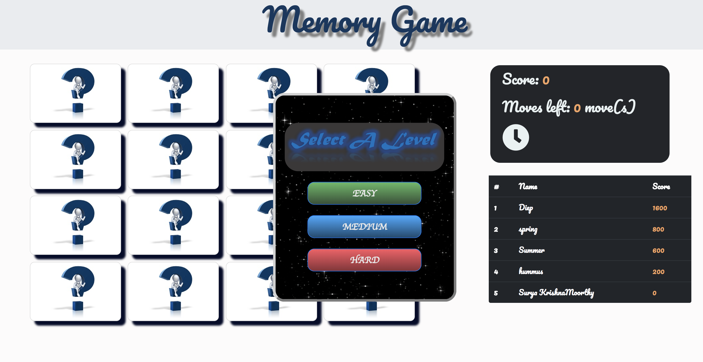
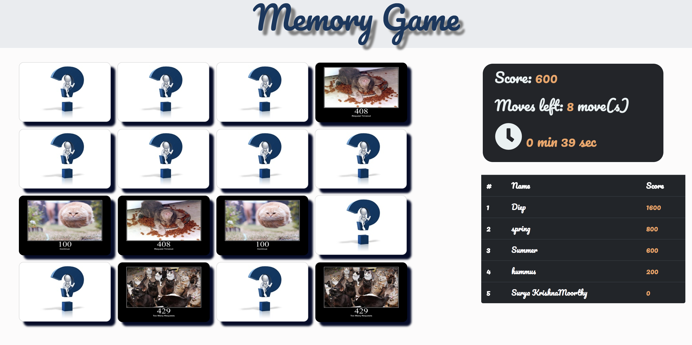
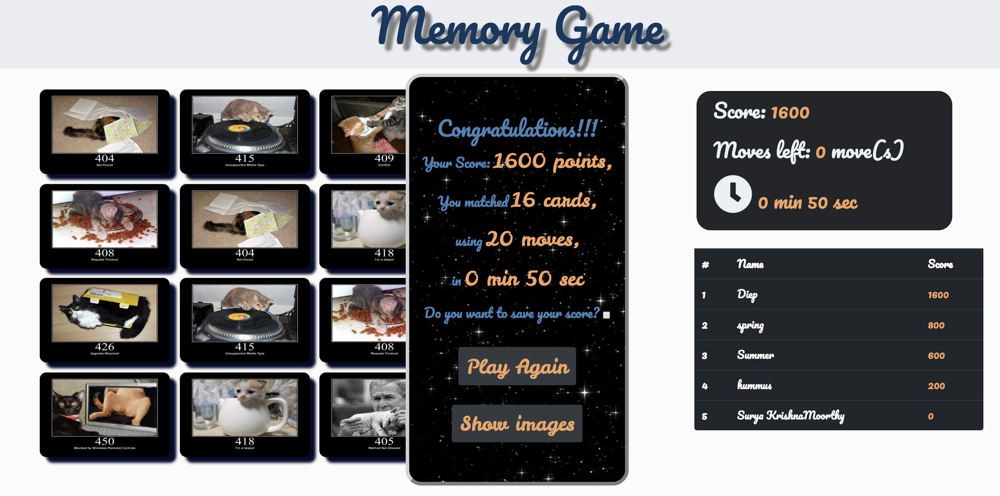
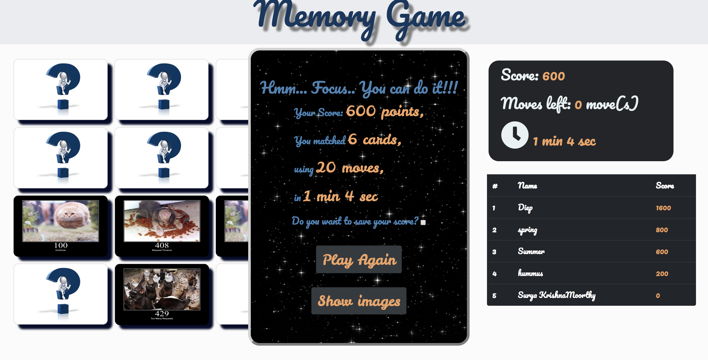
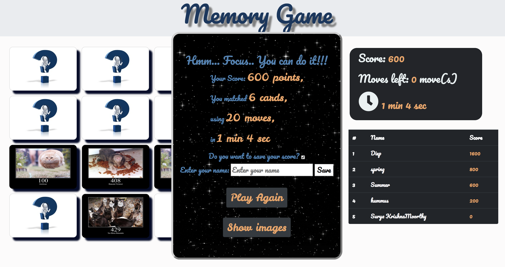
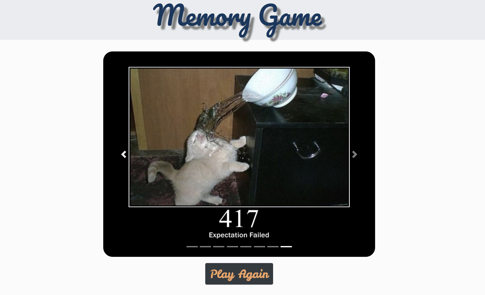

 # **Memory Game**
 
 This is a concentration game. It is a particularly good game for young children, and a leisurely and fun game for adults. There are funny cat images which are relative to http status codes.

------------------------------
## About

[Memory Game](http://memory-game-surya.surge.sh/)

1. There are 16 cards faced down.
2. The user is allowed to flip two cards at a time.
3. The objective of the game is to turn over maximum pairs of matching cards in a specific number of moves.
4. The user can select the level of the game.
5. After level selection, the user will able to see all the images for about half a  second.
6. The user can also opt to save their name and highest score.

## Did you know?!!

- Memory games have been shown to help prevent some memory-related illnesses, such as Alzheimer’s disease.
- The first World Memory Championships were held in 1991 in London.
- Emerging research claims that a proficient working memory is a better determinate for individual intelligence than IQ score.

##How to install?
-Fork and clone the repo.
-Run npm install in the repo.
-Run npm run dev start.

## What memory game looks like.

### The start page looks like this.

### When cards are matched it stays faced up.

### When game is finished a popup window displays the status.

### To save score check the checkbox.

### To display images in the cards.

